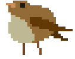
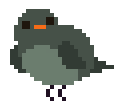

# Bird Watch Game
  

     

## Table of contents
* [Overview](#overview)
* [Examples](#examples)
* [Technologies](#technologies)
* [Usage](#usage)
* [Credit](#credit)
* [Limitations](#limitations)

## Overview
This is a game *focused* around taking in focus pictures of birds.
You start with common birds and based on how blurry your photo's are, as well as how rare the bird is, your photos will sell for more. Once you sell enough pictures, you will be able to learn what the rarer birds look like. These rarer birds are harder to take pictures of because they fly away quickly, however, pictures of them will sell for more!

## Examples

> Video of the starter world

## Technologies
- HTML / CSS
- VanillaJS
- Bootstrap
- TravisCI

## Usage
Play the game [here](https://birdwatch.games/ "Bird Watch Game")! *(birdwatch.games)*  
Testing is done with Jest  
`npm run test` to run tests

## Credit
### Image Credit
- Birds, by [fulifuli](https://fulifuli.tumblr.com/post/165438203610/all-of-the-birbs-check-out-my-society6)
- World 2, by [Simorico](https://www.deviantart.com/simorico/art/Night-City-in-the-Mountains-736964685)
- Bat, by [CaioBraga](https://itch.io/jam/jamuary-second-chances/rate/546859)
- Fox, by [liliajohn](https://picsart.com/en_au/i/sticker-8bit-fox-236120435020212)

## Limitations
- [ ] No account system
  - data is stored in local storage so the users' progress is limited to a single browser
  - no way to implement a leaderboard

## License
Licensed under the [GNU General Public License v3.0](LICENSE)
